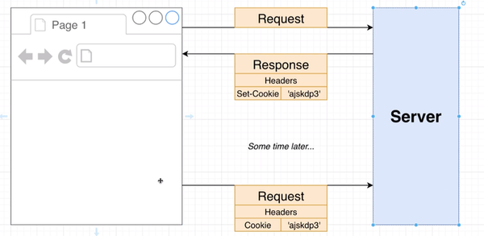
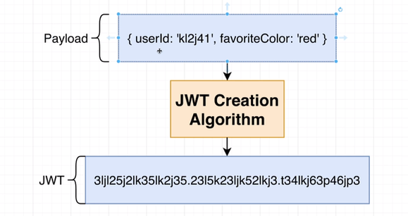
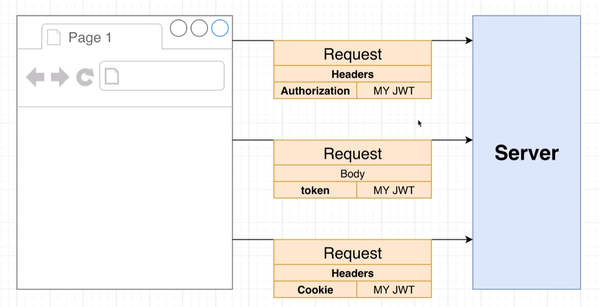
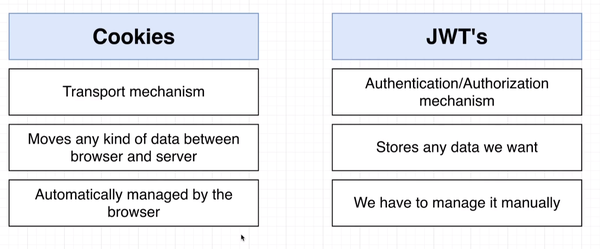

# Ticketing Microservice Project

This Project Related to Microservice A Quick Start To Go From

### Authentication Mechanism And what we Are going to Use

- Option #1
- Option #2
- Option #3

### JWT Vs Cookie

JWT and Cookie Both are two Different Things Because when we are going to use
**Cookie** we're Going to Store some kind of Encoded Token Inside it so user
cannot access these information but JWT Is Different

##### Let's Start Explain More Deeper about JWT & Cookie

<!--ts-->

- [What is Cookie](#what-is-cookie)
- [What is JWT](#what-is-jwt)
- [JWT Vs Cookie](#jwt-vs-cookie)
<!--te-->

### What is Cookie

When user Send Request to Server The Server Sends a Response Back over to the Browser it can Optionally include a header Value and Set whatever it going to be Automatically store inside the **Browser** So later when the browser send Request it will include these information

### What is JWT

In JWT We are going to take some arbitrary piece of information that we refer to as the **payload** so this can some kind of object have id or name or whatever and
take this payload pass it to **JWT Creation Algorithm** and we get the token we want
and later on we can use **Decoding Algorithm** And extract the original Object

There is Different Ways to Store The JWT Token Either in the **\*Request Headers** as key Value of Sending it Through the **Request Body** Or Even Store it as **cookie**

### JWT Vs Cookie

**Cookie** is a Transport Mechanism a way of Communicating information between the Server and the Browser they do not necessarily do anything loosely coupled to Authorization we use them for that but they do not necessarily this is not the only thing can do  

**JWT**
Json web Token on the other hand are all about the **Authentication & Authorization** that is what they're intended to Serve we can store any form of data we want also we manage JWT Manually not like Cookie Managed by Browser

### Required Staff

- Docker & minikube, Kubectl
- Ingress Addon Through [Kubernetes-Ingress](https://kubernetes.github.io/ingress-nginx/deploy)
